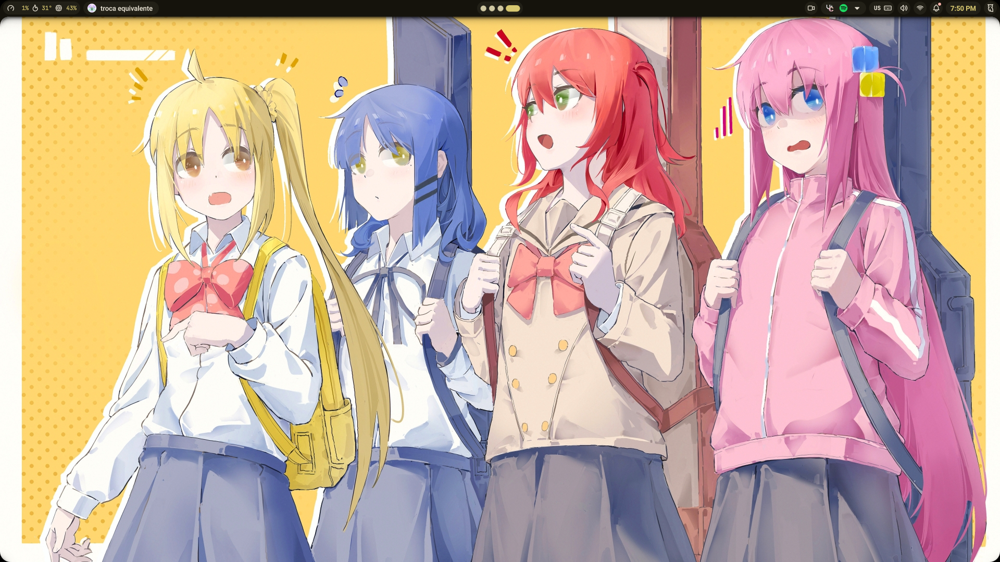
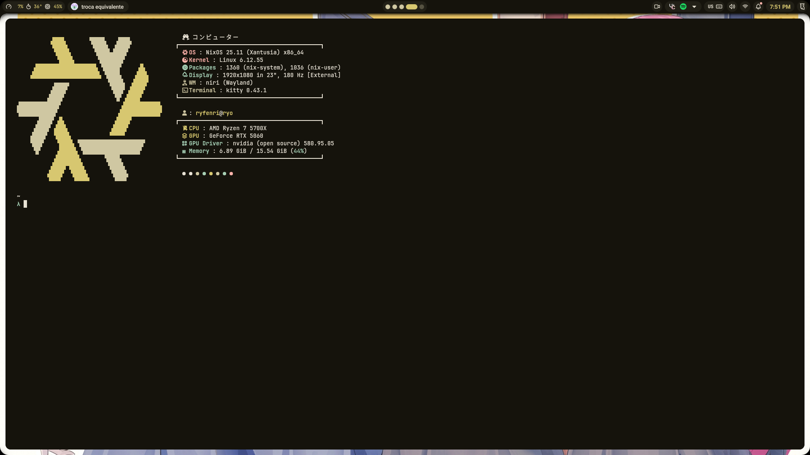

<h1 align="center">Nixos dotfiles</h1>

## Components

- **WM:** [niri](https://yalter.github.io/niri/)
- **OS:** [nixos](https://endeavouros.com/)
- **Terminal:** [kitty](https://sw.kovidgoyal.net/kitty/)
- **Shell:** [zsh](https://wiki.archlinux.org/title/Zsh)
- **File Manager:** [nautilus](https://github.com/GNOME/nautilus)
- **Application Launcher:** [rofi](https://github.com/davatorium/rofi)
- **Bar:** [noctalia-shell](https://docs.noctalia.dev/)
- **Compositor:** [niri](https://yalter.github.io/niri/)
- **Notification:** [noctalia-shell](https://docs.noctalia.dev/)

## Preview

