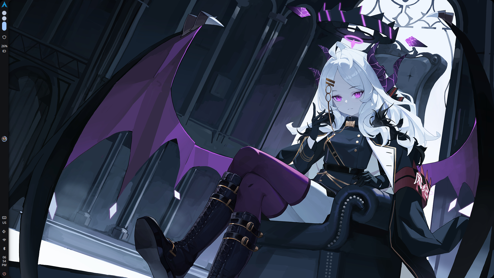

<h1 align="center">Hyprland dotfiles</h1>

## Components

- **WM:** [hyprland](https://hyprland.org/)
- **OS:** [arch linux](https://endeavouros.com/)
- **Terminal:** [kitty](https://sw.kovidgoyal.net/kitty/)
- **Shell:** [zsh](https://wiki.archlinux.org/title/Zsh)
- **File Manager:** [dolphin](https://github.com/GNOME/nautilus)
- **Application Launcher:** [rofi](https://github.com/davatorium/rofi)
- **Bar:** [waybar](https://github.com/Alexays/Waybar)
- **Desktop Shell**: [noctalia-shell](https://github.com/noctalia-dev/noctalia-shell)
- **Compositor:** [hyprland](https://github.com/hyprwm/Hyprland)
- **Notifmcation:** [dunst](https://github.com/ErikReider/SwayNotificationCenter)

> [!INFO]
> I only use the noctalia shell when i'm not using waybar vice versa
> for now it doesn't exist very unique things on my dots

## Preview

